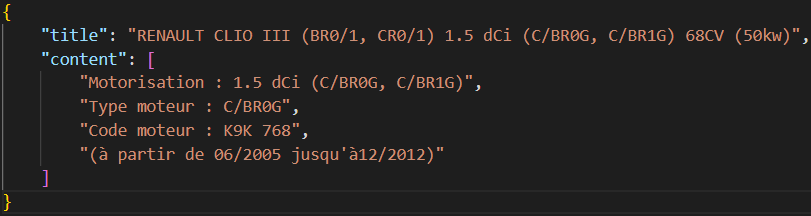

# French-Car-Scrapper
Get informations about a French car by its numberplate (AA-123-BB)

___

getCarData(numberplate) return in a "body.json" file informations about the car.

```Javascript
getCarData("AA-123-BB")
```


